# Project C# Mobile 2022-2023
Naam en email: **Van Kimmenade Anton (anton.vanKimmenade@STUDENT.PXL.BE)**

Titel applicatie: **SESHApp**

De SESHAPP is een app voor fans van TEAMSESH, met in het bijzonder voor fans van het bekendste lid, BONES. 
In de app kunnen gebruikers alle albums van BONES in FLAC-formaat downloaden en luisteren, en ze 
kunnen ook up-to-date blijven met hun kledinglijn. Het idee is gebaseerd op een bestaande app die 
momenteel niet meer functioneel is (zie play store link bij bronnen). De muziekspeler is vanaf nul opgebouwd 
en gebruikt alleen de Android.Media.MediaPlayer om media af te spelen. Hoewel de app zelf geen 
mogelijkheid biedt om kleding te kopen, kan het gebruikers doorsturen naar de officiële website 
waar ze kleding kunnen kopen. 

**De SESHAPP biedt een handige en gemakkelijke manier 
voor fans van TEAMSESH om hun favoriete muziek te luisteren en de laatste updates te zien van de 
kledinglijn van de groep.**

Opsomming belangrijkste kenmerken en onderdelen/features van de applicatie: 
* Download BONES albums lokaal in hoge kwaliteit
* Luister naar gedownloade albums en scrobble deze met <a href="https://www.last.fm" target="_blank">LastFm<a>
* Overzicht van kledinglijn
* Account aanmaken om likes bij te houden

# Logboek
* 29/9/2022: Project aangemaakt
* 2/10/2022: Basisfunctionaliteit album download af
* 3/10/2022: Basic zoek functie gemaakt
* 5/10/2022: Geprobeert compatibel te maken met iOS & Windows (niet gelukt)
* 10/10/2022: Basic UI homepagina kleding
* 11/10/2022: CarouselView toegevoegd
* 15/10/2022: Kleding DetailPagina af & iconen/splashscreen gemaakt
* 19/10/2022: Live currency aanpassing
* 20/10/2022: Favorites list
* 30/10/2022: Music player afgemaakt
* 02/11/2022: MVVM folder structuur aangemaakt
* 12/11/2022: MVVM folder structuur aangemaakt merch
* 13/11/2022: Muziekspeler notificaties afgewerkt
* 14/11/2022: Last.fm scrobbling afgewerkt
* 15/11/2022: Betere scrobbling method & two way likes
* 22/11/2022: Basis login functionaliteit
* 27/11/2022: Registratie
* 28/11/2022: Tweede database met extra persoonlijke gegevens & update account gestart
* 5/12/2022: Albums via firebase inladen
* 19/12/2022: Likes omzetten naar firebase
* 29/12/2022 - 04/01/2023: Laatste bug fixes, polijsten van functionaliteiten en video opnemen
  

# Optioneel: Screenshots
*Voorzie eventueel enkele screenshots van je app in actie.*

  
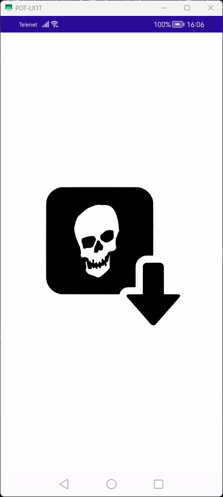

  
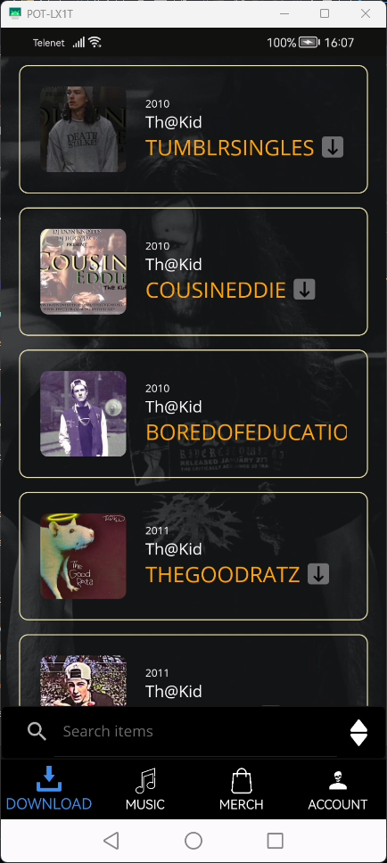

  
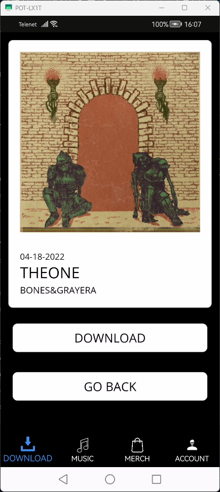

  
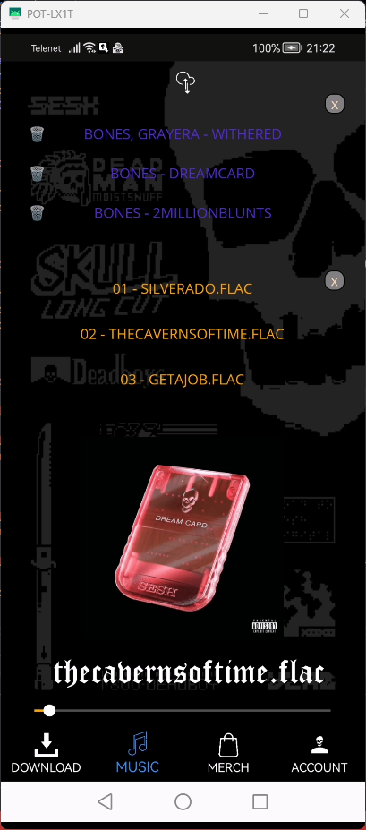

  
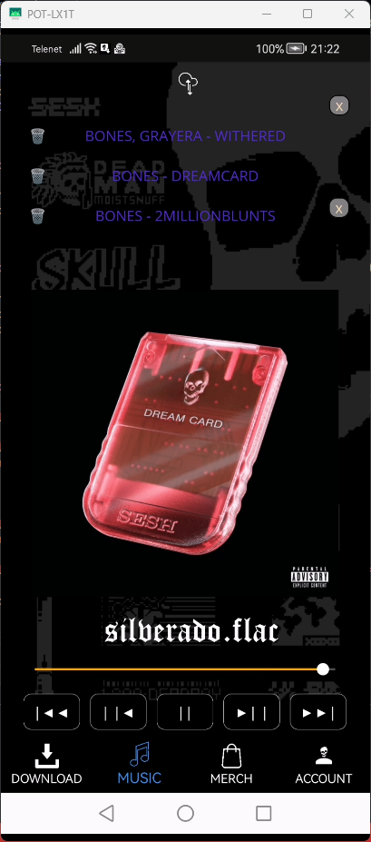

  
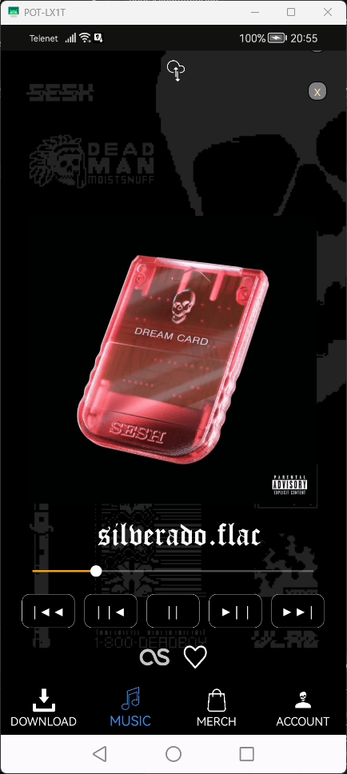

  
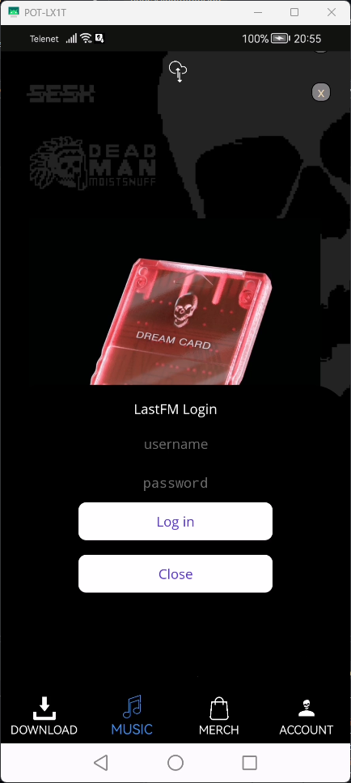

  
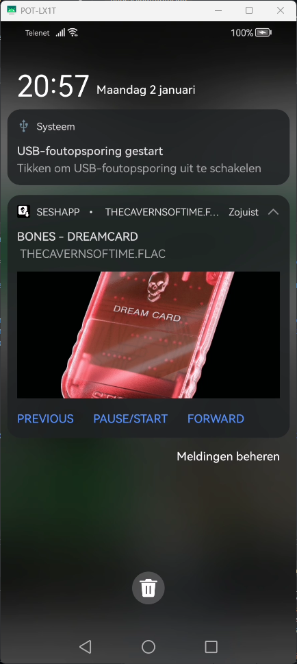

  
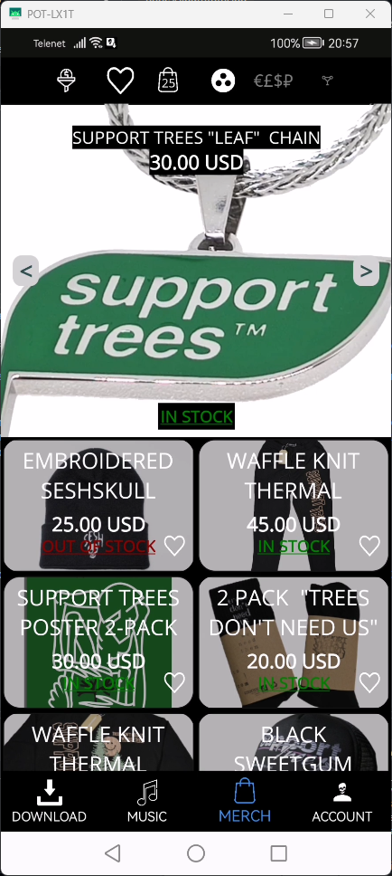

  
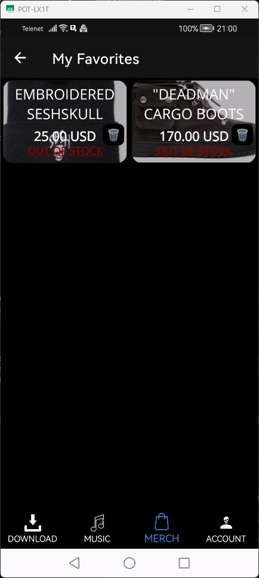

  
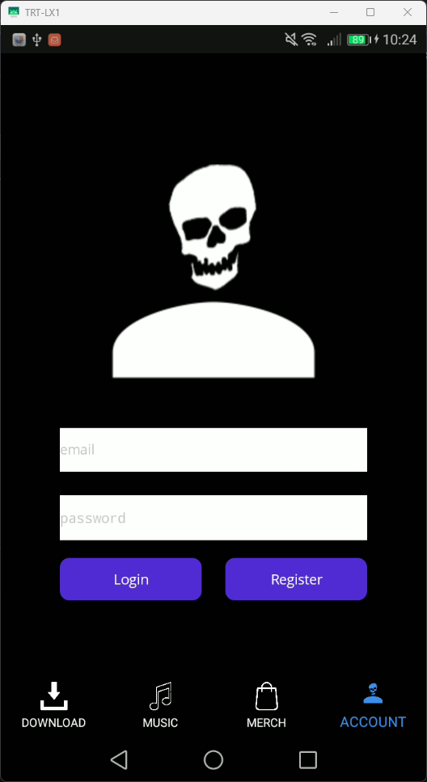

  
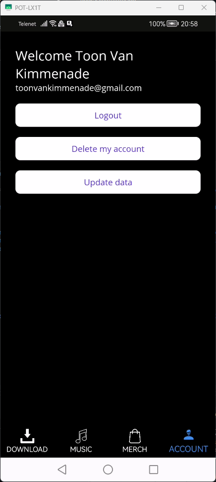

  
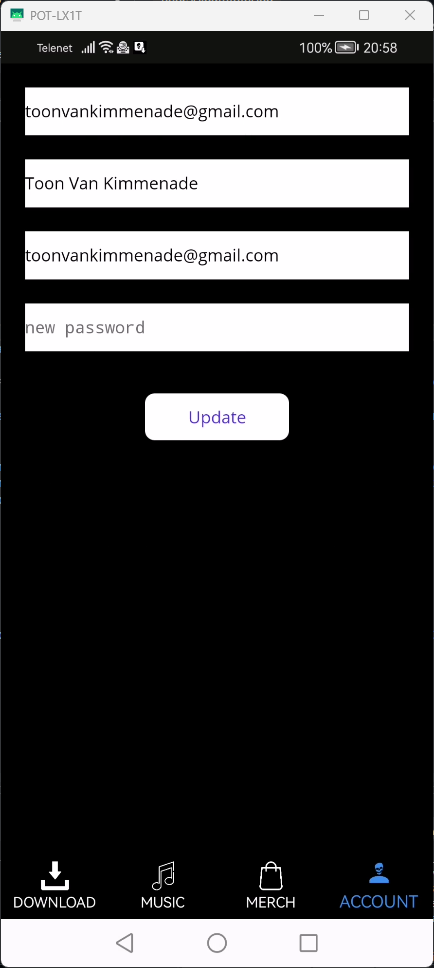
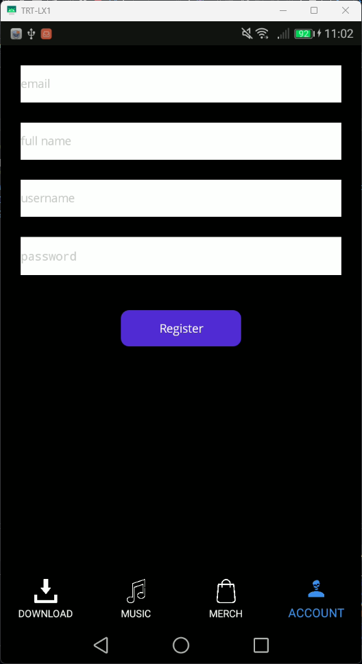

## Klik op de link hieronder om de video te bekijken!
https://youtu.be/-TMKff5HjkA

# Bronnen
* CommunityToolkit https://github.com/CommunityToolkit/Maui
* Inflatable.LastFM https://github.com/inflatablefriends/lastfm
* Plugin.LocalNotification https://github.com/thudugala/Plugin.LocalNotification
* SharpCompress https://github.com/adamhathcock/sharpcompress
* Xamarin CrossDownloadManager https://github.com/SimonSimCity/Xamarin-CrossDownloadManager
* CodeHollow.FeedReader https://github.com/arminreiter/FeedReader
* Icons https://labs.openai.com/
* Album covers https://www.discogs.com/artist/1635814-Bones-28
* Albums https://drive.google.com/drive/folders/1jXsM7lOWBs_cO5qVnOADachit38UaPgY?usp=share_link
* Albums gedownload via https://deemix.app/gui, https://github.com/yaronzz/Tidal-Media-Downloader, https://www.freezerapk.pro/
* XML Data Sources 
  * https://teamsesh.bigcartel.com/products.xml
  * https://teamseshmerchscraps.bigcartel.com/products.xml
  * https://www.supporttrees.com/products.xml
  * https://endorphinfitnesswear.bigcartel.com/
* Firebase.Authentication.Net https://github.com/step-up-labs/firebase-authentication-dotnet
* Firesharp https://github.com/ziyasal/FireSharp
* Plugin.LocalNotification https://github.com/thudugala/Plugin.LocalNotification
* Currency Exchange API https://api.exchangerate.host
* Video bekeken voor local push notifications https://youtu.be/dWdXXGa1_hI 

# Gebaseerd op
SESHAPP (muziekspeler en meer, app niet functioneel) : https://play.google.com/store/apps/details?id=org.teamsesh.seshapp  
SESHstation (enkel radio en kleren) : https://play.google.com/store/apps/details?id=team.sesh.teamsesh

# Future work
* Graag had ik een eigen radio geintegreerd in de app
* Mogelijkheid om kleren via de app te kopen (niet mogelijk wegens dat ik niet de eigenaar van winkel ben)
* App beschikbaar op iOS & Windows
* Chat functie tussen gebruikers
